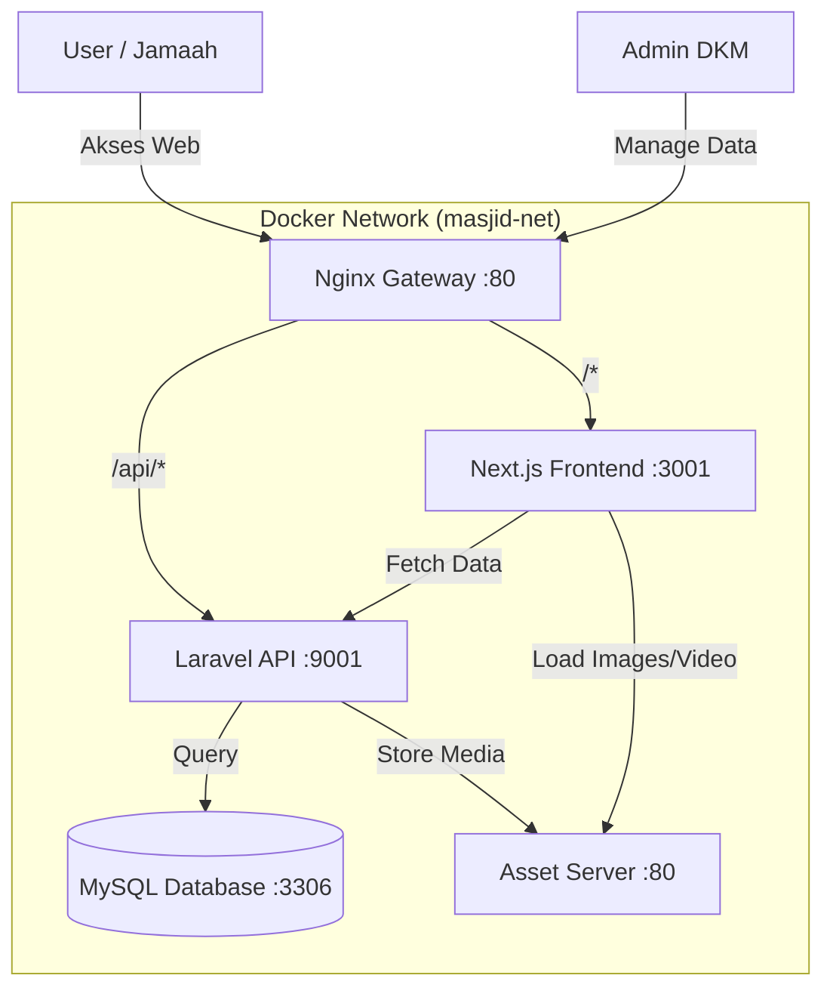

# 🕌 Sistem Pengumuman Masjid Digital (Mosque Digital Announcement System)


Sebuah sistem informasi digital berbasis web modern untuk menampilkan informasi masjid, jadwal sholat, dan kegiatan keagamaan secara real-time dan interaktif. Dirancang dengan arsitektur **Semi-Microservice** menggunakan Docker untuk kemudahan deployment dan skalabilitas.

---

## 📖 Ringkasan Proyek (Project Overview)

Sistem ini dibuat untuk menggantikan papan pengumuman konvensional di masjid dengan layar digital yang dinamis. Sistem ini memungkinkan pengurus masjid (DKM) untuk mengelola konten informasi dari mana saja melalui panel admin yang aman, sementara jamaah dapat melihat informasi terkini melalui layar monitor di masjid.

**Tujuan Utama:**
1.  **Modernisasi Informasi**: Mengganti papan tulis/kertas dengan tampilan digital yang menarik.
2.  **Efisiensi Pengelolaan**: Memudahkan update jadwal sholat, kajian, dan laporan keuangan tanpa perlu mencetak banner.
3.  **Multimedia Support**: Mendukung gambar dan video untuk penyampaian informasi yang lebih efektif.

---

## ✨ Fitur Unggulan (Key Features)

### 🖥️ Tampilan Publik (Public Display)
*   **Jadwal Sholat Real-time**: Otomatis update sesuai lokasi.
*   **Running Text**: Informasi singkat yang berjalan di bawah layar.
*   **Multimedia Slider**: Menampilkan poster kajian (Gambar) dan video dokumentasi/ceramah (Video).
*   **Responsive Design**: Tampilan menyesuaikan ukuran layar (TV, Monitor, Tablet).
*   **Mode Gelap/Terang**: Tampilan yang nyaman di mata.

### 🛡️ Panel Admin (Management System)
*   **Dashboard Statistik**: Ringkasan jumlah pengumuman dan status sistem.
*   **Manajemen Pengumuman (CRUD)**:
    *   ✅ Buat, Edit, Hapus Pengumuman.
    *   ✅ **Rich Text Editor (Quill)**: Format teks sesuka hati (Bold, Italic, List, dll).
    *   ✅ **Upload Media**: Dukungan upload **Gambar** dan **Video** (MP4/WebM).
    *   ✅ **Preview Live**: Lihat hasil tampilan sebelum dipublish.
*   **Manajemen Kategori**: Kelompokkan info (Kajian, Jumat, Keuangan, dll).
*   **Pengaturan Sistem**: Ubah teks berjalan, kontak masjid, dan konfigurasi lainnya.
*   **Sistem Keamanan**: Login terproteksi dengan token (Sanctum) dan auto-logout.
*   **Notifikasi Interaktif**: Alert sistem yang informatif saat data berhasil disimpan atau dihapus.

---

## 🏗️ Arsitektur Sistem (System Architecture)

Sistem ini dibangun menggunakan pendekatan **Semi-Microservice** yang dijalankan di atas **Docker Container**.



**Penjelasan Komponen:**
1.  **Gateway (Nginx)**: Pintu gerbang utama. Mengarahkan request user ke Frontend atau Backend.
2.  **Frontend (Next.js)**: Antarmuka pengguna yang cepat dan interaktif.
3.  **Backend (Laravel)**: Pusat logika bisnis dan pengolahan data.
4.  **Database (MySQL)**: Tempat penyimpanan data pengumuman dan user.
5.  **Asset Server**: Server khusus untuk melayani file gambar dan video agar lebih cepat.

### 📦 Detail Container Docker

Berikut adalah daftar container yang berjalan dalam sistem ini beserta fungsinya:

| Nama Container | Image Base | Port Internal | Fungsi Utama |
| :--- | :--- | :--- | :--- |
| **`nginx_gateway_masjid`** | `nginx:alpine` | `80`, `443` | **Reverse Proxy**. Mengatur lalu lintas request dari user. Jika user minta halaman web, diarahkan ke Frontend. Jika minta data, diarahkan ke API. Juga menangani SSL (HTTPS). |
| **`nextjs_masjid`** | `node:18-alpine` | `3000` | **Frontend UI**. Menjalankan aplikasi Next.js. Container ini merender halaman web yang dilihat user. |
| **`nginx_api_masjid`** | `nginx:alpine` | `80` | **Web Server API**. Melayani request HTTP untuk aplikasi Laravel. Bertugas meneruskan request PHP ke container `php_fpm_masjid`. |
| **`php_fpm_masjid`** | `php:8.2-fpm` | `9000` | **PHP Processor**. Mesin utama yang mengeksekusi kode PHP (Laravel). Menerima perintah dari Nginx API dan mengolah logika bisnis. |
| **`mysql_masjid`** | `mysql:8.0` | `3306` | **Database Server**. Tempat menyimpan semua data: user, pengumuman, jadwal sholat, dll. Data disimpan persisten di volume docker. |
| **`phpmyadmin_masjid`** | `phpmyadmin` | `80` | **DB Manager**. Antarmuka visual untuk mengelola database MySQL. Memudahkan admin mengecek data mentah tanpa coding. |
| **`assets_server_masjid`** | `nginx:alpine` | `80` | **Static File Server**. Khusus melayani file statis (gambar/video) yang diupload. Dipisahkan agar beban server utama lebih ringan. |

---

## 🛠️ Teknologi yang Digunakan (Tech Stack)

| Kategori | Teknologi | Deskripsi |
| :--- | :--- | :--- |
| **Frontend** | **Next.js 16 (App Router)** | Framework React terbaru untuk performa tinggi. |
| | **Tailwind CSS** | Styling modern dan responsif. |
| | **React Quill** | Editor teks kaya fitur untuk admin. |
| | **Axios** | Komunikasi data ke backend. |
| **Backend** | **Laravel 11** | Framework PHP yang robust dan aman. |
| | **Laravel Sanctum** | Sistem autentikasi token yang aman. |
| **Database** | **MySQL 8** | Database relasional yang handal. |
| | **phpMyAdmin** | Tool visual untuk manajemen database. |
| **DevOps** | **Docker & Compose** | Kontainerisasi aplikasi agar mudah dijalankan di mana saja. |
| | **Nginx** | Web server performa tinggi sebagai Reverse Proxy. |

---

## 🚀 Panduan Instalasi (Installation Guide)

Ikuti langkah ini untuk menjalankan aplikasi di komputer lokal Anda.

### Prasyarat (Prerequisites)
Pastikan komputer Anda sudah terinstall:
*   [Docker Desktop](https://www.docker.com/products/docker-desktop/) (Wajib aktif)
*   [Git](https://git-scm.com/)

### Langkah 1: Clone Repository
```bash
git clone https://github.com/username/mosque-announcement-app.git
cd mosque-announcement-app
```

### Langkah 2: Setup Network
Kita perlu membuat "jalan raya" khusus untuk komunikasi antar container.
```bash
docker network create masjid-net
```

### Langkah 3: Konfigurasi Environment
Salin file konfigurasi contoh untuk Backend.
```bash
cd api-mosque-announcement/mosque-announcement-api
cp .env.example .env
```
*Edit file `.env` jika perlu, namun defaultnya sudah cukup untuk development.*

### Langkah 4: Setup SSL (Wajib untuk HTTPS)
Aplikasi ini menggunakan **HTTPS** via Nginx. Anda perlu membuat sertifikat SSL lokal agar gateway berjalan normal.

1.  **Install mkcert:**
    *   **Windows:** `choco install mkcert` (via Chocolatey)
    *   **Mac/Linux:** `brew install mkcert` atau cek dokumentasi resmi.

2.  **Generate Sertifikat:**
    Jalankan perintah ini di terminal (root project):
    ```bash
    mkcert -install
    cd gateway-mosque-announcement/nginx/certs
    mkcert masjid.test db.masjid.test localhost 127.0.0.1 ::1
    cd ../../..
    ```
    *Ini akan membuat file `masjid.test+5.pem` dan key-nya di folder yang benar.*

### Langkah 5: Jalankan Aplikasi
Jalankan perintah berikut secara berurutan untuk menghindari error koneksi.

**1. Jalankan Database:**
```bash
cd ../../database
docker-compose up -d
```

**2. Jalankan Backend (API):**
```bash
cd ../api-mosque-announcement
docker-compose up -d --build
```
*Tunggu beberapa saat hingga container `laravel_masjid` berjalan.*

**3. Setup Database Laravel:**
```bash
docker exec -it laravel_masjid bash
# Di dalam container:
php artisan key:generate
php artisan migrate:fresh --seed
php artisan storage:link
exit
```

**4. Jalankan Asset Server & Frontend:**
```bash
cd ../assets-mosque-announcement
docker-compose up -d

cd ../ui-mosque-announcement
docker-compose up -d
```

**5. Jalankan Gateway:**
```bash
cd ../gateway-mosque-announcement
docker-compose up -d
```

### Langkah 5: Setup Host (Windows)
Agar bisa diakses via `masjid.test`, tambahkan ini ke file `C:\Windows\System32\drivers\etc\hosts`:
```text
127.0.0.1 masjid.test
127.0.0.1 db.masjid.test
```

---

## 📖 Cara Penggunaan (User Guide)

### Akses Aplikasi
*   **Halaman Utama (Publik):** Buka `https://masjid.test`
*   **Halaman Admin:** Buka `https://masjid.test/login`

### Login Admin
Gunakan akun default berikut untuk masuk:
*   **Email:** `admin@masjid.com`
*   **Password:** `password123`

### Menambah Pengumuman Baru
1.  Masuk ke menu **Pengumuman**.
2.  Klik tombol **+ Tambah Pengumuman**.
3.  Isi **Judul** dan **Konten** pengumuman.
4.  Pilih **Kategori** (misal: Kajian, Jumat).
5.  (Opsional) Upload **Gambar** atau **Video** pendukung.
6.  Klik **Simpan**.
7.  Pengumuman akan langsung tampil di halaman depan!

---

## 🔌 API Reference (Simplified)

Berikut adalah endpoint utama yang digunakan oleh Frontend:

| Method | Endpoint | Deskripsi |
| :--- | :--- | :--- |
| `POST` | `/api/login` | Autentikasi user admin. |
| `GET` | `/api/announcements` | Mengambil daftar pengumuman (Public). |
| `POST` | `/api/announcements` | Membuat pengumuman baru (Support Image/Video). |
| `PUT` | `/api/announcements/{id}` | Update pengumuman. |
| `DELETE` | `/api/announcements/{id}` | Hapus pengumuman. |
| `GET` | `/api/prayer-times` | Mengambil jadwal sholat. |

---

## ❓ Troubleshooting

**Q: Website tidak bisa dibuka (Site can't be reached)?**
A: Pastikan semua container docker berjalan dengan mengetik `docker ps`. Pastikan juga Gateway (Nginx) sudah up.

**Q: Gambar/Video tidak muncul?**
A: Pastikan perintah `php artisan storage:link` sudah dijalankan di dalam container Laravel.

**Q: Error "Network not found"?**
A: Jalankan `docker network create masjid-net` sebelum menjalankan `docker-compose up`.

---

<p align="center">
  Made with ❤️ for the Ummah
</p>
